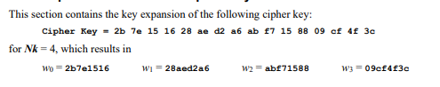
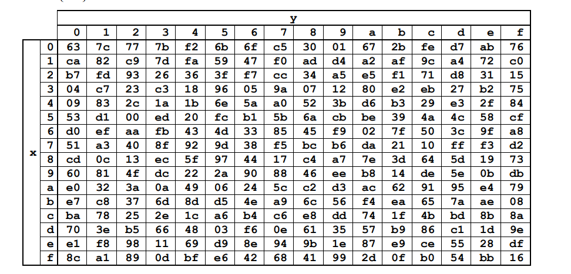
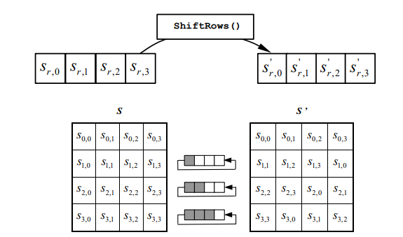
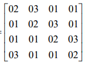
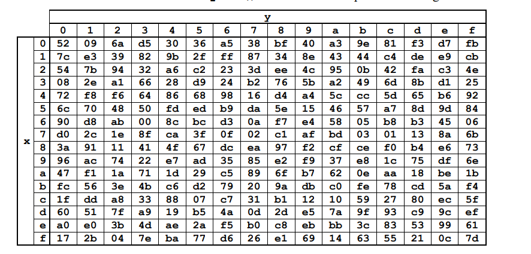
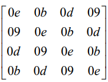

# Лабораторна №2

## Симетричне шифрування. Алгоритм AES

### Мета: дослідити принципи роботи симетричного шифрування на прикладі алгоритму AES.

### Завдання:

#### Реалізувати алгоритм симетричного шифрування AES-128

### Хід роботи:

1. Початкові дані:
   1. **key** - ключ наведений у текстовому вигляді
   2. **input** - повідомелння яке треба зашифрувати теж наведене у вигляді тексту
   3. **Nr** - кількість раундів. В AES-128 кількість раундів дорівнює десяти.
   4. **Nb** - розмір блоку - 4.
   5. **Nk** - довжина ключа - 4.
   6. **expandedKey** - розширений ключ довжиною Nk. Складається з 32-бітних слів. Перші 4 слова взяті з ключа. Послідуючі розраховані алгоритмом **expansion()**
   7. **rcon** - константи на кожний раунд. Потрібні для розрахування розширених ключів.
   8. **sbox** - таблиця для виконання алгоритму **subBytes()**.
   9. **mixColumnConstant** - константи для виконання алгоритму **mixColumns()**.
   10. **state** - матриця, над котрою проводяться всі операції шифрування. Початкове повідомлення перетворується у цю матрицю.
2. Дії/методи/розрахунки/операції які використовуються в алгоритмі:
   1. Додавання в формулах - це XOR
   2. Множення в формулах - це множення в GF(2^8). Алгоритм розглянеться нижче.
   3. **subBytes()** - перетворення. Основане на таблиці **sbox**.
   4. **shiftRows()** - перетворення. Кожний рядок **state** циклічно зсувається вліво на *і* разів. *і* - номер рядку. Починається з нуля. Тобто перший рядок завжди зсувається на нуль, тобто не перетворується.
   5. **mixColumns()** - перетворення. В цьому методі відбувається справжня магія, яка буде розглянуте нижче.

# Expansion   
Почнемо з розширення ключів. В нас є початковий ключ, який був строкою, але ми вже встигли перетворити у масив байтів.



Також на фото видно наші перші слова. **w[0..4]**. Ці чотири слова будуть використані у першому раунді шифрування. Але ж у нас цілих 10 раундів. Тому треба натворити ще більше ключів. Для цього використовується алгоритм **expansion()**

Так ось. Потрібно створити п'яте слово, оскільки чотири вже є. Для цього, береться попереднье, тобто четверте слово, і провдяться наступні операції послідовно
1. RotWord() - циклічний сдвиг вліво на один. Було: 09cf4f3c (четверте слово) -> Стало: cf4f3c09
2. SubWord() - розбиває слово масив байтів та використовує над масивом операцію **subBytes()**.

## SubBytes

В нас є така чудова таблиця під назвою **sbox**:



В нас є наступні байти **[cf 4f 3c 09]**. По рядках знаходимо **с** по стовпцях знаходимо **f** -> **8a**
Виходить в нас було: **[cf 4f 3c 09]**. Стало: **[8a 84 eb 01]**

3. Потім операція XOR з **rcon**
4. Операція XOR з (поточний елемент - 4) -> тобто з першим словом.

## RCON
Що таке **rcon** - як вже було сказано це константи.
```
1000000 2000000 4000000 8000000 10000000 20000000 40000000 80000000 1b000000 36000000
```

Якщо подивитись на перші числа, то є відчуття що це 2^i і потім число здвинули вліво на 6. Але на восьмому елементі з'являється 1b?.
Твердження про 2^i вірне. Але в самому початку ми говорили про те що множення - це множення в GF(2^8). Настав час розглянути алгоритм.
В нас як ви зрозуміли початкове значення це 1. 

### Multiplication GF(2^8)
По перше треба перевірити чи воно не **overflow**, чи воно не більше 128, оскільки більше значення в байт не влазить. if (x & 0x80 != 0)

Якщо значення в нормі -> x = x << 1; x = x ^ 0x1b. 

Якщо значення переповнене -> x = x ^ 0x1b.

## ShiftRows
Це легка трансформація, як говорилось вище кожний рядок виконує циклічний здвиг вліво на *i*. Де *i* номер рядку починаючи з нуля.


## MixColumns
Припустимо треба перетворити **перший** елемент матриці. Тоді береться весь **перший** стовпець матриці та множимо на перший рядок матриці **mixColumnConstant**



Не забуваємо що множення відбувається за GF(2^8)


## Cipher
Виконуються послідовно команди
1. До **state** додається **roundKey** - ключ раунду це перші чотири слова.
2. Потім в циклі 10 разів (10 раундів) від нуля до десяти
   1. SubBytes(state)
   2. ShiftRows(state)
   3. MixColumns(state)
   4. state + roundKey
3. Після циклу. Зверніть увагу немає **mixColumns()**
   1. SubBytes(state)
   2. ShiftRows(state)
   3. state + roundKey

## InvCipher
Виконуються послідовно команди
1. До **state** додається **roundKey** - ключ раунду це **останні** чотири слова.
2. Потім в циклі 10 разів (10 раундів) від десяти до нуля
   1. invShiftBytes(state)
   2. invSubBytes(state)
   3. state + roundKey (в першій ітерації ключ - передостанній) 
   4. invMixColumns(state)
3. Після циклу. Зверніть увагу немає **invMixColumns()**
   1. invShiftRows(state)
   2. invSubBytes(state)
   3. state + roundKey (перший ключ)

## InvSubBytes
Теж саме що і **subBytes()** тільки таблиця **sbox** наступна:



## InvShiftRows
Теж саме що і **shiftRows()** тільки рядки здвигаємо навпаки, циклічно вправо

## InvMixColumns
Теж саме що і **mixColumns()** тільки використовується інша таблиця **mixColumnConstant**

