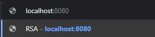
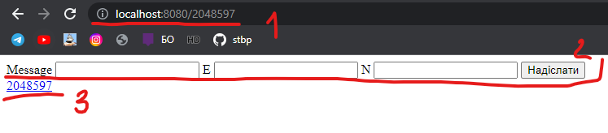
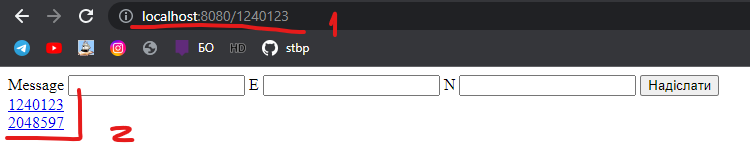
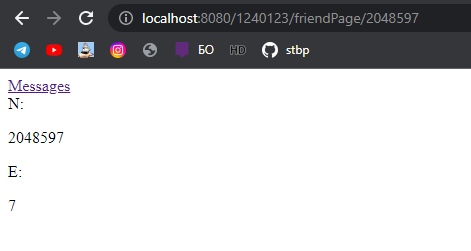
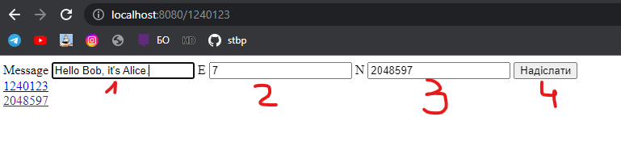
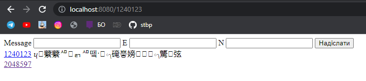
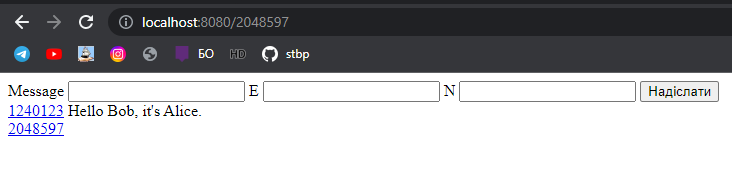
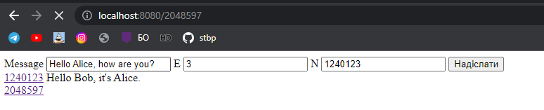
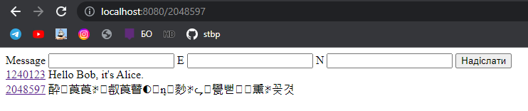
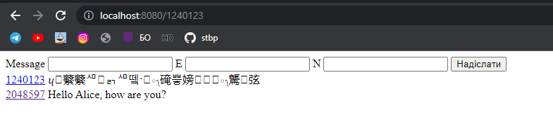

# Лабораторна №3

## Асиметричне шифрування. Алгоритм RSA

### Мета: дослідити і реалізувати механізм асиметричного алгоритму шифрування RSA. 

### Завдання:

#### Розробити додаток обміну таємними посиланнями між двома клієнтами за допомогою алгоритму шифрування RSA
- Реалізувати алгоритм генерації ключів (public/private keys) для алгоритму RSA. Створити ключі заданої довжини.
- Реалізувати та продемонструвати роботу алгоритму шифрування та дешифрування повідомлень RSA.
- Підтвердити роботу реалізованого алгоритму шляхом порівняння результату кодування з існуючим алгоритмом.

### Хід роботи:

1. Початкові дані:
   1. **p, q** - примітивні випадкові числа.
   2. **n** - (p * q)
   3. **l** - підраховано за допомогою функції lcm(a, b) = |a*b| / gcd(a, b). gcd - найбільше спільний дільник.
   4. **e** - це таке **примітивне число**, яке більше ніж два та менше ніж **l**
   5. **d** - рахується за формулою -> **(d*e) mod l = 1**
2. Таким чином публічний ключ це **{e, n}**, приватний ключ це **{d, n}**.
Якщо існує два користувачі Боб і Аліса, тоді щоб Бобу відправити повідомлення Алісі, 
він повинен мати її **публічний ключ**, за допомогою якого він шифрує своє повідомлення. 
Коли це повідомлення надходить до Аліси вона за допомогою свого **приватного ключа** розшифровує.
3. Шифрування **(c(m) = m^e mod n)**:
   1. Нехай **n** = 3233, **e** = 17
   2. І є повідомлення "ABC", перевівши за допомогою ascii таблиці у числові значення отримаємо наступне: [65, 66, 67]
   3. Зашифруємо перше значення, тоді **encrypted = 65 ^ 17 mod 3233 = 2790**
   4. Зашифрувавши останні значення аналогічно, отримаємо наступне: **[2790, 524, 641]**
4. Розшифрування **(m(c) = c^d mod n)**
   1. Нехай **n** = 3233, **d** = 413
   2. І є зашифровані значення: **[2790, 524, 641]**
   3. Розшифруємо переш значення, тоді **decrypted = 2790 ^ 413 mod 3233 = 65**
   4. Розшифрувавши інші значення аналогічно, отримаємо наступне **[65, 66, 67]**
   5. За ascii таблицею це символи "A", "B", "C".
5. Серверна частина
   1. Сервер оброблюватиме чотири запити
      1. **get** - коли користувач вперше входить, формується його **id** - це число **n** взяте із ключа, та **key**. Робить редірект на **get("/{id}")**
      2. **get("/{id}")** - повертає користувачеві сторінку з повідомленнями, та формою для посилання повідомлень.
      3. **post("/{id}")** - оброблює дані з форми, а саме **повідомлення, e, n**, на основі переданих даних шифрує повідомлення, та додає до списку повідомлень, список містить **id** того хто надсилав, та саме повідомлення.
      4. **get("/{id}/friendPage/{uKey})** - повертає сторінку з даними користувача (uKey).
   2. На головній сторінці знаходиться форма, **id** усіх користувачів та їх повідомлення. **id** - це посилання на сторінку з публічним ключем користувача.
   3. Коли відправляється повідомлення, воно зашифровується. І залишається у пам'яті програми.
   4. Коли користувач заходить на головну сторінку, програма проходить по усім повідомленням, які зберігаються у програмі, розшифровує за ключем даного користувача. Таким чином, якщо повідомлення відправлене йому, він побачить змістовний текст. Якщо не йому, тоді повідомлення теж розшифрується, але все одно матиме не зрозумілі символи.
   5. Також користувач який надсилав повідомлення не може його прочитати, тому що його ключ не підходить для розшифрування його ж повідомлення. Це слід враховувати.

### Як працює то на практиці?

Зайдемо на сайт за посиланням

1. Тоді програма додає у посилання **id**
2. Показує форму
3. Та список користувачів, поки що один, це ми

1. Зайде інший користувач
2. Бачить вже декілька користувачів, один з **id** його

Щоб відправити повідомлення, треба дізнатись іншого користувача публічний ключ - **n** та **e**. Запам'ятовуємо.

Вставляємо у форму
1. Саме повідомлення
2. Число **e**
3. Число **n**
4. Надсилаємо

У себе бачимо ієрогліфи

Інший користувач, якому надсилали, бачить розшифрований текст

Спробуємо відповісти, заповнюємо форму, та вказуємо повідомлення

Як то виглядає з одного боку

Як то виглядає з іншого боку

Якщо зайде третій користувач, побачить ієрогліфи від двох користувачів.