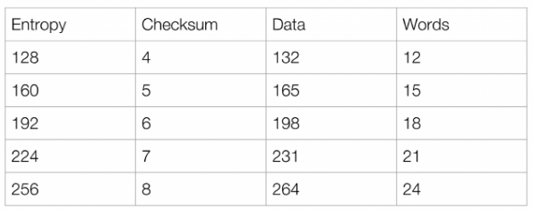
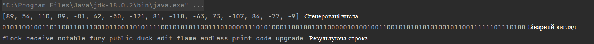

# Лабораторна №4

## Використання мнемонічних фраз для формування ключів шифрування

### Мета: дослідити принцип формування ключів шифрування, та використання в алгоритмах шифрування.

### Завдання:

- Використовуючи алгоритм bip39, створити seed генератора псевдовипадкових
    чисел за допомогою мнемонічної фрази та стосовні ключі шифрування.
- Зашифрувати текст.
- Використовуючи раніше створену мнемонічну фразу, відновити ключі шифрування та
  дешифрувати текст. Вдосконалитись, що оригінальний та дешифрований тексти однакові.

### Хід роботи:

Потрібно згенерувати псевдовипадку строку різних слів. Для цього можна використовувати словники. 
Така строка може мати вигляд:

"flock receive notable fury public duck edit flame endless print code upgrade".

Якщо звернути увагу, то можна помітити вона складається з 12 слів. Чому 12?

Алгоритм шифрування 128-бітної версії. Тобто **Entropy = 128**. 

Далі знаходиться **Checksum = Entropy / 32 = 128 / 32 = 4**.

Кількість слів **Words = (Entropy + Checksum) / 11 = (128 + 4) / 11 = 12**.

Таким чином отримаємо таблицю для різних версій.

### Приклад

Випадково були згенеровані байти і потрібно перетворити у строку випадкових слів.

Байти: **[59 36 6e 59 af 2a ce 87 51 92 c1 49 95 54 b3 f7]**

Перетворюється у бінарний вигляд: **01011001001101100110111001011001101011110010101011001110100001110101000110010010110000010100100110010101010101001011001111110111**

До бінарного вигляду додається **Checksum = 4 = 0100**: **010110010011011001101110010110011010111100101010110011101000011101010001100100101100000101001001100101010101010010110011111101110100**

Строка ділиться по 11 бітів, отримуються значення у діапазоні **[0..2048]**.
- 01011001001 - 713
- 10110011011 - 1435
- 10010110011 - 1203
- 01011110010 - 754
- 10101100111 - 1383
- 01000011101 - 541
- 01000110010 - 562
- 01011000001 - 705
- 01001001100 - 588
- 10101010101 - 1365
- 00101100111 - 359 
- 11101110100 - 1908

Потім звертаючись до словника який містить 2048 слів вибираються ті слова індекс яких відповідає числам зверху.
Таким чином утворюється строка: **flock receive notable fury public duck edit flame endless print code upgrade**

Користувач отримує цей ключ, зберігає на фізичному носії(папір тощо). Коли треба скористуватися ключем для шифрування/розшифрування
вводить у програму цей ключ, ключ зворотнім шляхом перетворюється у 16 байтів. 16 байтів використовуються в алгоритмі шифрування/дешифрування.

### Приклад роботи

