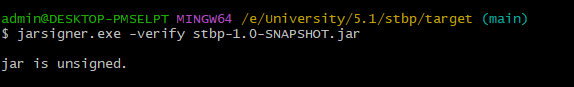
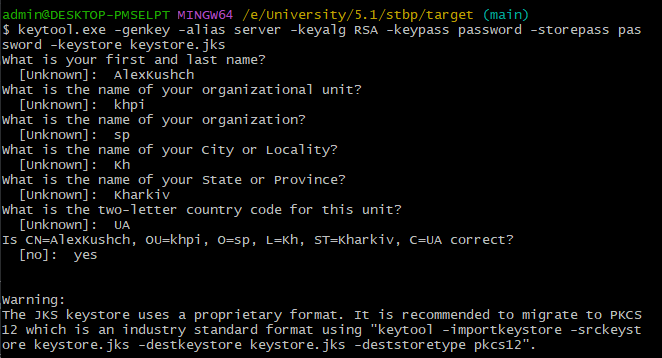
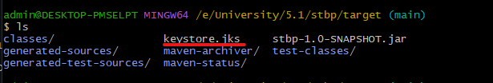
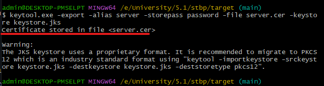
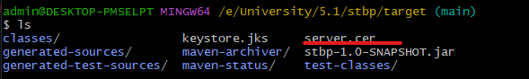
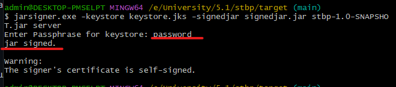
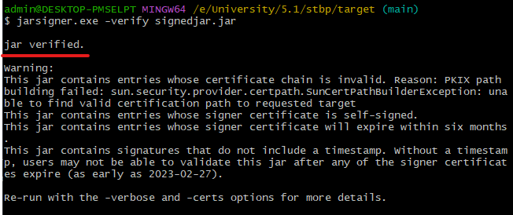

# Лабораторна №9

## Захист від зміни бінарного файлу

---

### Мета: Навчитися підписувати виконувані файли.

### Завдання:

- Створити сертифікат
- Проінсталювати його в систему, щоб він був "довіреним"
- Використовуючи проект будь-якої попередньої роботи, виконати підпис виконуваного файлу
за допомогою утиліти JarSigner
- Виконати верифікацію підпису:
  - чи є підписаний сертифікат валідним
  - чи не було зміни файлу та його код цілісний

### Хід роботи

Для початку перевіряється чи не підписаний ***.jar*** файл з самого початку

Як видно на фото відповідь: ні

Тоді генерується ключ наступною командою. Заповнюються персональні дані, та записується ключ у файл ***.jks***

Далі створюється сертифікат ***.cer*** на основі згенерованого файлу ***.jks*** наступною командою.

Залишається підписати ***.jar*** файл створеним сертифікатом ***.cer*** наступною командою.

Створюється новий окремий ***.jar*** який є підписаний. Залишається перевірити його.

Як видно на фото, ***.jar*** сертифікований.